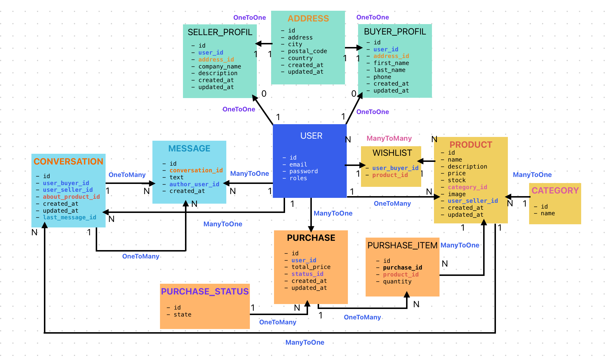

### 📍 Cachier des charges : MarketPlace

#### 📕 Pitch du projet témoin :

Application web de type marketplace pour la vente de produits en ligne.

- Utilisateurs: acheteurs et vendeurs + admin.
- Fonctionnalités: authentification, gestion de panier, messagerie, wishlist, pagination, administration, téléchargement d'images.

#### 📌 Fonctionnalités attendues :

1. **Authentification**:
    - Inscription et connexion des utilisateurs.
    - Gestion des rôles: acheteur, vendeur, admin.
    - Sécurisation des routes.
    - Gestion des erreurs d'authentification.
    - Espace d'administration.
    - Gestion des utilisateurs via l'interface d'administration.
    - (Mot de passe oublié. V2)
2. **Produits**:
   - Création, modification, suppression de produits.
   - Affichage des produits.
   - Affichage des détails d'un produit.
   - Recherche de produits.
   - Filtrage des produits par catégorie.
   - Pagination des produits.
   - Gestion des favoris.
   - Gestion des stocks.
   - Gestion des catégories.
   - (Gestion des avis. V2)
   - (Gestion des promotions. V2)
3. **Panier**:
   - Ajout, suppression, modification des produits dans le panier.
   - Affichage du panier.
   - Validation de la commande.
   - Gestion des commandes.
   - (Gestion des adresses de livraison. V2)
   - (Gestion des paiements. V2)
   - (Gestion des factures. V2)
4. **Messagerie**:
   - Envoi et réception de messages entre utilisateurs.
   - Gestion des conversations.
   - (Notifications. V2)
   - (Messagerie instantanée. V2)
5. **Wishlist**:
   - Ajout et suppression de produits dans la wishlist.
   - Affichage de la wishlist.
7. **Administration**:
   - Gestion des utilisateurs. | Role Admin
   - Gestion des produits. | Role Vendor
   - Gestion des catégories. | Role Vendor
   - Gestion des commandes. | Role Vendor
   - Gestion des stocks. | Role Vendor
8. **Téléchargement d'images**:
   - Téléchargement d'images pour les produits.
   - Affichage des images des produits.
   - (Redimensionnement des images. V2)

#### 📌 Users stories :
 --- Acheteur --- 
1. En tant qu'acheteur, je veux pouvoir m'inscrire sur la plateforme pour pouvoir acheter des produits.
2. En tant qu'acheteur, je veux pouvoir me connecter à mon compte pour accéder à mes informations.
3. En tant qu'acheteur, je veux pouvoir consulter la liste des produits disponibles sur la plateforme.
4. En tant qu'acheteur, je veux pouvoir consulter les détails d'un produit pour en savoir plus.
5. En tant qu'acheteur, je veux pouvoir rechercher des produits par mot-clé pour trouver ce que je cherche.
6. En tant qu'acheteur, je veux pouvoir filtrer les produits par catégorie pour trouver ce que je cherche.
7. En tant qu'acheteur, je veux pouvoir ajouter des produits à mon panier pour les acheter plus tard.
8. En tant qu'acheteur, je veux pouvoir consulter mon panier pour voir les produits que j'ai ajoutés.
9. En tant qu'acheteur, je veux pouvoir valider ma commande pour acheter les produits de mon panier.
10. En tant qu'acheteur, je veux pouvoir consulter mes commandes passées pour suivre leur état.
11. En tant qu'acheteur, je veux pouvoir ajouter des produits à ma wishlist pour les acheter plus tard.
12. En tant qu'acheteur, je veux pouvoir consulter ma wishlist pour voir les produits que j'ai ajoutés.
13. En tant qu'acheteur, je veux pouvoir envoyer des messages à d'autres utilisateurs pour poser des questions ou discuter de produits.
14. En tant qu'acheteur, je veux pouvoir consulter mes messages pour suivre mes conversations.
 --- Vendeur --- 
15. En tant que vendeur, je veux pouvoir m'inscrire sur la plateforme pour pouvoir vendre des produits.
16. En tant que vendeur, je veux pouvoir me connecter à mon compte pour accéder à mes informations.
17. En tant que vendeur, je veux pouvoir ajouter des produits à la plateforme pour les vendre.
18. En tant que vendeur, je veux pouvoir modifier les produits que j'ai ajoutés à la plateforme.
19. En tant que vendeur, je veux pouvoir consulter la liste des produits que j'ai ajoutés à la plateforme.
20. En tant que vendeur, je veux pouvoir consulter les commandes passées pour mes produits.
21. En tant que vendeur, je veux pouvoir consulter les stocks de mes produits pour gérer les quantités.
22. En tant que vendeur, je veux pouvoir ajouter/modifier des catégories pour classer mes produits.
23. En tant que vendeur, je veux pouvoir consulter mes messages et y répondre pour communiquer avec les acheteurs.
 --- Admin --- 
24. En tant qu'admin, je veux pouvoir me connecter à la plateforme pour accéder à l'interface d'administration.
25. En tant qu'admin, je veux pouvoir gérer les utilisateurs de la plateforme.
26. En tant qu'admin, je veux pouvoir censurer des produits ou des utilisateurs.

#### 📌 Models de données :

- User:
    - id INT AUTO_INCREMENT PRIMARY KEY NOT NULL
    - email VARCHAR(255) UNIQUE NOT NULL
    - password VARCHAR(255) NOT NULL
    - roles JSON NOT NULL
    - created_at DATETIME NOT NULL
    - updated_at DATETIME NOT NULL

- Profile_Buyer:
    - id INT AUTO_INCREMENT PRIMARY KEY NOT NULL
    - user INT FOREIGN KEY REFERENCES User(id)
    - address INT FOREIGN KEY REFERENCES Address(id)
    - first_name VARCHAR(255) NOT NULL
    - last_name VARCHAR(255) NOT NULL
    - phone VARCHAR(255) NOT NULL
    - created_at DATETIME NOT NULL
    - updated_at DATETIME NOT NULL

- Profile_Seller:
    - id INT AUTO_INCREMENT PRIMARY KEY NOT NULL
    - user INT FOREIGN KEY REFERENCES User(id)
    - address INT FOREIGN KEY REFERENCES Address(id)
    - company_name VARCHAR(255) NOT NULL
    - description TEXT NOT NULL
    - image VARCHAR(255) NOT NULL
    - created_at DATETIME NOT NULL
    - updated_at DATETIME NOT NULL
  
- Address:
    - id INT AUTO_INCREMENT PRIMARY KEY NOT NULL
    - address VARCHAR(255) NOT NULL
    - city VARCHAR(255) NOT NULL
    - postal_code VARCHAR(255) NOT NULL
    - country VARCHAR(255) NOT NULL
    - created_at DATETIME NOT NULL
    - updated_at DATETIME NOT NULL

- Product:
    - id INT AUTO_INCREMENT PRIMARY KEY NOT NULL
    - name VARCHAR(255) NOT NULL
    - description TEXT NOT NULL
    - price FLOAT NOT NULL
    - stock INT NOT NULL
    - category INT FOREIGN KEY REFERENCES Category(id)
    - image VARCHAR(255) NOT NULL
    - user_seller INT FOREIGN KEY REFERENCES User(id)
    - created_at DATETIME NOT NULL
    - updated_at DATETIME NOT NULL

- Category:
    - id INT AUTO_INCREMENT PRIMARY KEY NOT NULL
    - name VARCHAR(255) NOT NULL

- Purchase:
    - id INT AUTO_INCREMENT PRIMARY KEY NOT NULL
    - user INT FOREIGN KEY REFERENCES User(id)
    - total_price FLOAT NOT NULL
    - status INT FOREIGN KEY REFERENCES PurchaseStatus(id)
    - created_at DATETIME NOT NULL
    - updated_at DATETIME NOT NULL

- PurchaseItem:
    - id INT AUTO_INCREMENT PRIMARY KEY NOT NULL
    - purchase INT FOREIGN KEY REFERENCES Purchase(id)
    - product INT FOREIGN KEY REFERENCES Product(id)
    - quantity INT NOT NULL

- PurchaseStatus:
    - id INT AUTO_INCREMENT PRIMARY KEY NOT NULL
    - state VARCHAR(255) NOT NULL

- Message:
  - id INT AUTO_INCREMENT PRIMARY KEY NOT NULL
  - conversation INT FOREIGN KEY REFERENCES Conversation(id)
  - text TEXT NOT NULL
  - author INT FOREIGN KEY REFERENCES User(id)
  - created_at DATETIME NOT NULL

- Conversation:
  - id INT AUTO_INCREMENT PRIMARY KEY NOT NULL
  - user_buyer INT FOREIGN KEY REFERENCES User(id)
  - user_seller INT FOREIGN KEY REFERENCES User(id)
  - product INT FOREIGN KEY REFERENCES Product(id)
  - created_at DATETIME NOT NULL
  - updated_at DATETIME NOT NULL
  - last_message_id INT FOREIGN KEY REFERENCES Message(id)
